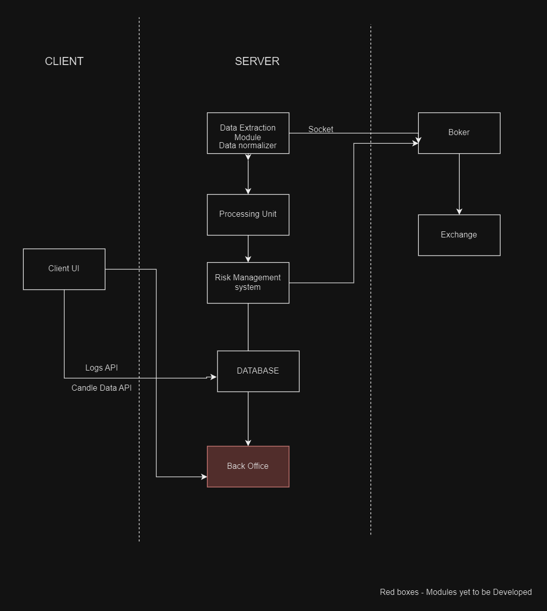
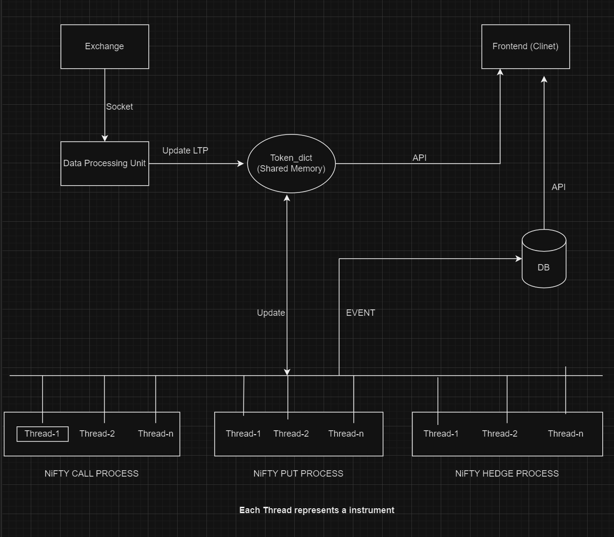

# Automated Intraday Options Trading Bot

This is a fully automated trading bot designed for executing intraday options strategies on exchanges like NSE and BSE. The bot currently supports the Alice Blue broker.

## Screenshots


*Visualize your trading positions in real-time.*


*PNL graphs similar to TradingView for individual instruments and overall strategy.*


*Detailed logs for each instrument.*

## Indices Supported

1. **NIFTY**
2. **BANKNIFTY**
3. **FINNIFTY**
4. **MIDCPNIFTY**
5. **SENSEX**
6. **BANKEX**

## Application Features

1. **Time-based Entry and Exit**: Automate trade entry and exit based on specific times.
2. **Frontend to Visualize Positions**: A user-friendly interface to monitor your trading positions.
3. **Manual Position Management**: Capability to manually manage your trading positions.
4. **RMS (Risk Management System)**: Risk management based on the total strategy loss.
5. **Brokerage Calculator**: Integrated calculator to estimate brokerage fees.
6. **Stop Loss for Individual Instruments**: Set stop losses for each instrument based on the entry price.
7. **Order Splitting**: Split orders to manage large trades efficiently.
8. **PNL Graphs**: Visualize profit and loss graphs similar to TradingView for overall strategies and individual instruments.
9. **Logging**: Collect detailed logs at the individual instrument level.
10. **Multi-processing and Multi-threading**: Use advanced techniques to reduce latency.
11. **Find all the instruments traded logs and graph data in `/instrument_data` folder.**

## Getting Started

### Prerequisites

- Python 3
- Alice Blue account and API credentials

### Installation

1. Clone the repository:
    ```sh
    git clone https://github.com/rk-RaviKataray/TradingBot.git
    cd TradingBot
    ```

2. Install the required packages:
    ```sh
    pip install -r requirements.txt
    ```

3. Add your Alice Blue credentials to `credentials.py`:
    ```python
    # credentials.py
    USERNAME = 'your_username'
    API_KEY = 'your_api_key'
    ```

### Configuration

1. Change the `Configuration_file` as per your requirements:

 ```python
    # Example config file with explanation
     "NIFTY":
    {
      "Exchange":"NSE",                       # valid_input: NSE/BSE 
      "Hedge_strikes_away_from_atm": 900,     # 900 points away from ATM strikes will be bought
      "Token":26000,
      "Strike_difference": 50,                
      "Priority":1,                           # In case of colliding expiries the instrument with higher priority will be chosen
      "Delta":[0.3],                          # strikes with 0.3 delta call will be shorted and maintained as per the market movement
      "Interest_rate":10,
      "OTM_quantity":50                       # quantity in lots 
  
    },
 ```

2.
### Usage

1. Run the bot:
    ```sh
    python flask_app.py
    ```

2. Access the frontend to visualize positions and manage trades:
    - Open your web browser and navigate to `http://localhost:5001`.

## Screenshots


*Architecture*


*Control Flow*


## Contributing

Contributions are welcome! Please fork the repository and create a pull request.


## Acknowledgements

- [Alice Blue API](https://docs.aliceblueonline.com/)
- [TradingView](https://www.tradingview.com/)


## Want your Strategy coded, contact me:

- rk.ravikataray@gmail.com
- Whatsapp: +46734790860


